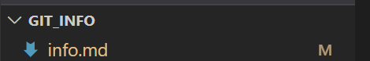

# Инструкция по работе с Git

## 1. Основные действия:
Скачать программу Git для своей операционной системы:
 - Для *Linux* нужно просто открыть терминал и установить приложение при помощи пакетного менеджера Вашего дистрибутива. 
 - Для *Ubuntu* команда будет выглядеть следующим образом:
  
          sudo apt-get install git

-  Для *Windows* — мы рекомендуем: 

          git for windows

   так как он содержит и клиент с графическим интерфейсом, и эмулятор bash.

- Для *OS X* — проще всего воспользоваться *"homebrew"*. После его установки запустите в терминале:

        brew install git

## 2. Создание репозитория
После запуска программы Git нужно добавить свое имя и электронную почту. Для того необходимо ввести две команды: 

     1. git config --global user.name 'Имя'
     2. git config --global user.email 'Почта'

Создайте на рабочем столе папку под названием git__info.
 В терминале откройте папку, нажав:

     File - Open a folder

Далее необходимо инициализировать репозиторий, использовав команду: 

       git init

Если получили обратное сообщение: 
 
     Initialized empty Git repository in /home/user/Desktop/git_info/.git/

Это значит, что репозиторий был успешно создан, но абсолютно пустой. 

- Теперь необходимо создать файл в нашем репозитории, для этого просто нажимаем на значок "создать новый файл", который отображается при наведении мыши на название папки слева в VS Code редакторе. 
- Название файла можем сделать любое, главное латинскими буквами и в конце названия проставить *.md*

## 3. Работа с файлом и самые необходимые команды

Ранее мы уже познакомились с командой git init чтобы инициализировать наш репозиторий, теперь нам нужно добавить в него наш файл. Для этого пропишем команду: 

    git add file name.md

Все изменения внесенные в файл нужно сохранять, в этом нам поможет команда:

       git commit -m 'Some message'
Быстрая команда, которая создает коммит с указанным комментарием. По умолчанию команда git commit открывает локально настроенный текстовый редактор с предложением ввести комментарий к коммиту. При передаче параметра -m текстовый редактор не открывается, а используется подставленный комментарий.

Так же есть еще одна команда:

       git commit -a 'Some message'
Выполнение коммита состояния со всеми изменениями в рабочем каталоге. Эта команда включает только изменения отслеживаемых файлов (тех, которые были в какой-то момент добавлены в историю с помощью команды git add).

Чтобы не прописывать команду git add каждый раз после внесения изменений в файле, можем использовать команду:

      git commit -a -m 'Some message'
Эта команда позволит обойти постояное повторение команды git add и сэкономит время

Для проверки статуса нужно ввести команду: 

     git status
Эта команда позволяет отследить состояние репозитория и помогает узнать, какие изменения необходимо зарегистрировать или какие изменения были внесены ранее (при необходимости, отменить)

     git giff
Очень важная команда. Её нужно обязательно запускать перед каждым коммитом. Она позволяет проанализировать добавляемые изменения и исправить возможные ошибки
 

     git log 
Команда используется для просмотра истории коммитов, начиная с самого свежего и уходя к истокам проекта. По умолчанию, она показывает лишь историю текущей ветки, но может быть настроена на вывод истории других, даже нескольких сразу, веток.

Универсальный инструмент git checkout позволяет переключаться между ветками, проверять старые коммиты и отменять локальные незакоммиченные изменения, переключая HEAD и изменяя рабочий каталог.

*Для переключения между ветками, введите команду:*
        
    git checkout [название ветки]

*Для того, чтобы перейти к определенному коммиту можно использовать команду:*

    git checkout code_commit

Мы рассмотрели только некоторые из основных команд для работы с Git программой. Существует еще много команд, которыми можно пользоваться для упрощения своей работы. 

## Ветки в  git
Что бы посмотретьв се ветки в  git, нужно ввести команду: 
git branch

Для создания новой ветки с именем  branch_name:
> git branch branch_name

Переместиться к ветке с именем  branch_name:
>git checkout branch_name